# CS294-112 HW 1: Imitation Learning

Dependencies: TensorFlow, MuJoCo version 1.31, OpenAI Gym

**Note**: MuJoCo versions until 1.5 do not support NVMe disks therefore won't be compatible with recent Mac machines.
There is a request for OpenAI to support it that can be followed [here](https://github.com/openai/gym/issues/638).

The only file that you need to look at is `run_expert.py`, which is code to load up an expert policy, run a specified number of roll-outs, and save out data.

In `experts/`, the provided expert policies are:
* Ant-v1.pkl
* HalfCheetah-v1.pkl
* Hopper-v1.pkl
* Humanoid-v1.pkl
* Reacher-v1.pkl
* Walker2d-v1.pkl

The name of the pickle file corresponds to the name of the gym environment.

# Results

## Summary table

|Environment   |Expert Reward Mean(std)|Behavior Cloning |DAgger             |
|--------------|-----------------------|-----------------|-------------------|
|Ant-v1        |4727.27(236.27)        |4689.20(52.14)   |**4825.16(76.79)** |
|HalfCheetah-v1|4125.13(85.51)         |3869.31(102.09)  |**4114.19(72.78)** |
|Hopper-v1     |3777.49(4.76)          |1181.05(152.07)  |**3779.39(5.24)**  |
|Humanoid-v1   |10393.68(47.56)        |**375.76(58.29)**|213.05(26.96)      |
|Reacher-v1    |-4.29(1.61)            |-8.20(2.11)      |**-4.20(1.41)**    |
|Walker2d-v1   |5510.97(46.70)         |2524.92(1758.67) |**5483.19(113.88)**|

**Hyperparameters:** batch_size = 128, 5 epochs, 5 iterations of DAgger, 50 roll-outs
**ANN:** 2 layer network with ReLU activation(64 hidden neurons)
**Optimizer**: Adam, lr = 0.007, weight_decay(L2)=0.0000001

## Visual demonstation

|Environment|Behavior Cloning|DAgger|
|-----------|----------------|------|
|Ant-v1|||
|HalfCheetah-v1|||
|Hopper-v1|||
|Reacher-v1|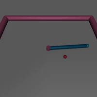|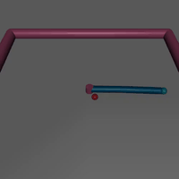|
|Walker2d-v1|||

## Summary:
As we can see, **DAgger performs much better than Behavior Cloning** in almost every case(for this model without varying paraneters), excluding Humanoid-v1 environment, because both algorithms didn't work out a good policy for this particular case. It may be a consequence of high dimensional input(~400 observations, ~100 actions), so the simple 2-layer ANN with 64 hidden neurons just can't handle this sophisticated data.

## Graphs

### Ant-v1
|Method|Reward|Loss|
|------|------|----|
|BC|||
|DA||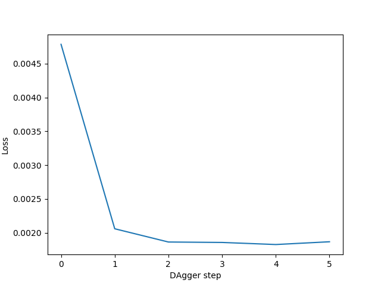|
### HalfCheetah-v1
|Method|Reward|Loss|
|------|------|----|
|BC||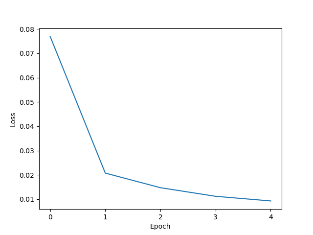|
|DA|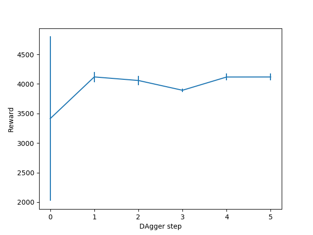|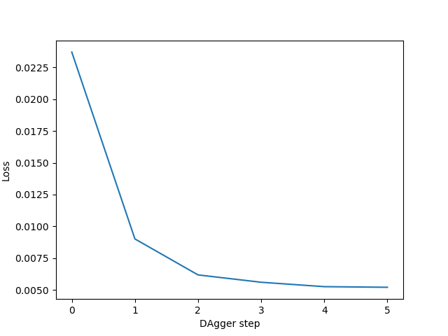|
### Hopper-v1
|Method|Reward|Loss|
|------|------|----|
|BC|||
|DA||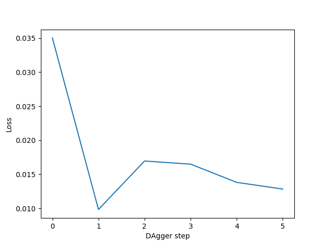|
### Humanoid-v1
|Method|Reward|Loss|
|------|------|----|
|BC|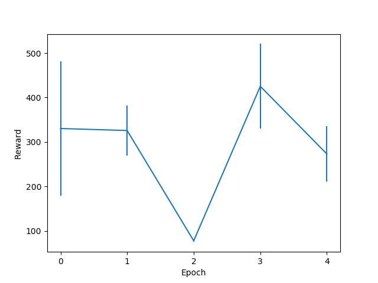|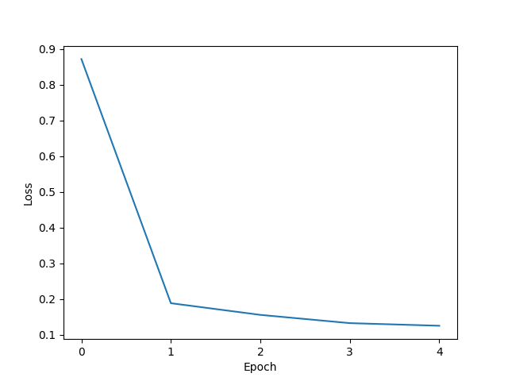|
|DA|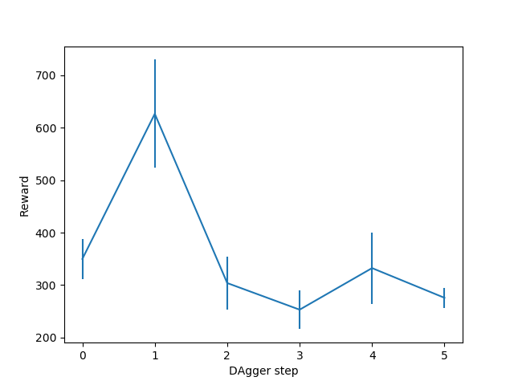||
### Reacher-v1
|Method|Reward|Loss|
|------|------|----|
|BC||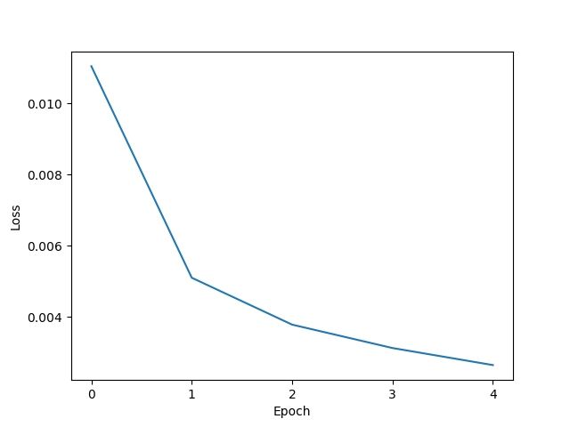|
|DA||| 
### Walker2d-v1
|Method|Reward|Loss|
|------|------|----|
|BC|||
|DA||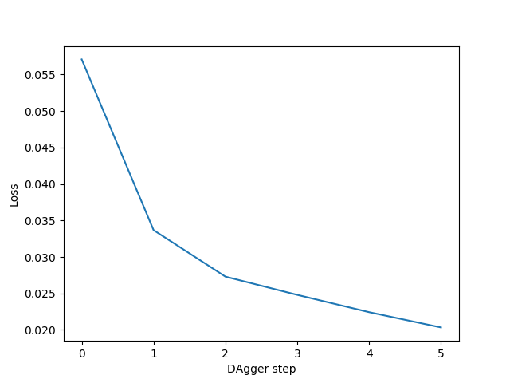|